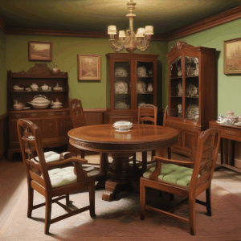

# Generative Models: What do they know? Do they know things? Let's find out! <h3>(Previous Title: *Intrinsic LoRA: A Generalist Approach for Discovering Knowledge in Generative Models*)</h3>

[Xiaodan Du](https://xiaodan.io),
[Nick Kolkin&dagger;](https://home.ttic.edu/~nickkolkin/home.html),
[Greg Shakhnarovich](https://home.ttic.edu/~gregory/),
[Anand Bhattad](https://anandbhattad.github.io/)

Toyota Technological Institute at Chicago, &dagger;Adobe Research

Abstract: *Generative models excel at mimicking real scenes, suggesting they might inherently encode important intrinsic scene properties. In this paper, we aim to explore the following key questions: (1) What intrinsic knowledge do generative models like GANs, Autoregressive models, and Diffusion models encode? (2) Can we establish a general framework to recover intrinsic representations from these models, regardless of their architecture or model type? (3) How minimal can the required learnable parameters and labeled data be to successfully recover this knowledge? (4) Is there a direct link between the quality of a generative model and the accuracy of the recovered scene intrinsics?*

*Our findings indicate that a small Low-Rank Adaptators (LoRA) can recover intrinsic images-depth, normals, albedo and shading-across different generators (Autoregressive, GANs and Diffusion) while using the same decoder head that generates the image. As LoRA is lightweight, we introduce very few learnable parameters (as few as 0.04% of Stable Diffusion model weights for a rank of 2), and we find that as few as 250 labeled images are enough to generate intrinsic images with these LoRA modules. Finally, we also show a positive correlation between the generative model's quality and the accuracy of the recovered intrinsics through control experiments.*


<a href="https://arxiv.org/abs/2311.17137"></a>
<a href="https://intrinsic-lora.github.io/"></a>

Many thanks to [neph1](https://github.com/neph1) for the [Blender Add-on](https://github.com/neph1/blender-intrinsic-lora) ([vid](https://youtu.be/oTtM4-GYlXk)) and [kijai](https://github.com/kijai) for the [ComfyUI integration](https://github.com/kijai/ComfyUI-KJNodes)

<p align="center">



## License
Since we use Stable Diffusion, we are releasing under their CreativeML Open RAIL-M license. 

## Updates
2024/6/28: Updated the repo with new title of the paper.

2024/2/13: We now provide inference code: `inference_sd_single.py`

2024/1/2: We provide checkpoints for our single step SD model. You can download them at [GDrive](https://drive.google.com/drive/folders/1BV2IQp6itGIi6QQS7Vgug4G7slJ3yDTG?usp=sharing). Load the checkpoint using 

```bash
pipeline.unet.load_attn_procs(torch.load('path/to/ckpt.bin'))
```

## Getting Started

**The main packages are listed below**
```bash
#Conda
pillow=9.2.0
python=3.8.15
pytorch=1.13.0
tokenizers=0.13.0.dev0
torchvision=0.14.0
tqdm=4.64.1
transformers=4.25.1
#pip
accelerate==0.22.0
diffusers==0.20.2
einops==0.6.1
huggingface-hub==0.16.4
numpy==1.22.4
wandb==0.12.21
```
**Get Necessary Stable Diffusion Checkpoints from [HuggingFace🤗](https://huggingface.co/models).**<br> 
We train our single-step UNet model using [SDv1.5](https://huggingface.co/runwayml/stable-diffusion-v1-5) and multi-step AugUNet model using [SDv2.1](https://huggingface.co/stabilityai/stable-diffusion-2-1). We initialize the additional input channels in AugUNet with [IP2P](https://huggingface.co/timbrooks/instruct-pix2pix).


## Usage
We provide code for training the single-step UNet models and the multi-step AugUNet models for surface normal and depth map extraction. Code for albedo and shading should be very similar. Please note that the code is developed for DIODE dataset. To train a model using your own dataset, you need to modify the dataloader. Here we assume that the pseudo labels are stored in the same folder structure as DIODE dataset.  <br><br>
Run the following command to train surface normal single-step UNet model
```bash
export MODEL_NAME="runwayml/stable-diffusion-v1-5"
export DATA_DIR="path/to/DIODE/normals"
export PSEUDO_DIR="path/to/pseudo/labels"
export HF_HOME="path/to/HuggingFace/cache/folder"

accelerate launch sd_single_diode_pseudo_normal.py \
--pretrained_model_name_or_path=$MODEL_NAME  \
--train_data_dir=$DATA_DIR \
--pseudo_root=$PSEUDO_DIR \
--output_dir="path/to/output/dir" \
--train_batch_size=4 \
--dataloader_num_workers=4 \
--learning_rate=1e-4 \
--report_to="wandb" \
--lr_warmup_steps=0 \
--max_train_steps=20000 \
--validation_steps=2500 \
--checkpointing_steps=2500 \
--rank=8 \
--scene_types='outdoor,indoors' \
--num_train_imgs=4000 \
--unified_prompt='surface normal' \
--resume_from_checkpoint='latest' \
--seed=1234
```
Run the following command to train depth single-step UNet model
```bash
export MODEL_NAME="runwayml/stable-diffusion-v1-5"
export DATA_DIR="path/to/DIODE/depths"
export PSEUDO_DIR="path/to/pseudo/labels"
export HF_HOME="path/to/HuggingFace/cache/folder"

accelerate launch sd_single_diode_pseudo_depth.py \
--pretrained_model_name_or_path=$MODEL_NAME  \
--train_data_dir=$DATA_DIR \
--pseudo_root=$PSEUDO_DIR \
--output_dir="path/to/output/dir" \
--train_batch_size=4 \
--dataloader_num_workers=4 \
--learning_rate=1e-4 \
--report_to="wandb" \
--lr_warmup_steps=0 \
--max_train_steps=20000 \
--validation_steps=2500 \
--checkpointing_steps=2500 \
--rank=8 \
--scene_types='outdoor,indoors' \
--num_train_imgs=4000 \
--unified_prompt='depth map' \
--resume_from_checkpoint='latest' \
--seed=1234
```
Run the following code to train surface normal multi-step AugUNet model
```bash
export MODEL_NAME="stabilityai/stable-diffusion-2-1"
export DATA_DIR="path/to/DIODE/normals"
export PSEUDO_DIR="path/to/pseudo/labels"
export HF_HOME="path/to/HuggingFace/cache/folder"

accelerate launch augunet_diode_pseudo_normal.py \
--pretrained_model_name_or_path=$MODEL_NAME  \
--train_data_dir=$DATA_DIR \
--pseudo_root=$PSEUDO_DIR \
--output_dir="path/to/output/dir" \
--train_batch_size=4 \
--dataloader_num_workers=4 \
--learning_rate=1e-4 \
--report_to="wandb" \
--lr_warmup_steps=0 \
--max_train_steps=50000 \
--validation_steps=2500 \
--checkpointing_steps=2500 \
--rank=8 \
--scene_types='outdoor,indoors' \
--unified_prompt='surface normal' \
--resume_from_checkpoint='latest' \
--seed=1234
```
Run the following code to train depth multi-step AugUNet model
```bash
export MODEL_NAME="stabilityai/stable-diffusion-2-1"
export DATA_DIR="path/to/DIODE/depths"
export PSEUDO_DIR="path/to/pseudo/labels"
export HF_HOME="path/to/HuggingFace/cache/folder"

accelerate launch augunet_diode_pseudo_depth.py \
--pretrained_model_name_or_path=$MODEL_NAME  \
--train_data_dir=$DATA_DIR \
--pseudo_root=$PSEUDO_DIR \
--output_dir="path/to/output/dir" \
--train_batch_size=4 \
--dataloader_num_workers=4 \
--learning_rate=1e-4 \
--report_to="wandb" \
--lr_warmup_steps=0 \
--max_train_steps=50000 \
--validation_steps=2500 \
--checkpointing_steps=2500 \
--rank=8 \
--scene_types='outdoor,indoors' \
--unified_prompt='depth map' \
--resume_from_checkpoint='latest' \
--seed=1234
```
Our code should be compatible with "fp16" precision by just appending `--mixed_precision="fp16"` to `accelerate launch`. However we train all of our models using the full precision. Please let us know if you encounter problems using "fp16".<br>


## BibTex
```
@article{du2023generative,
  title={Generative Models: What do they know? Do they know things? Let's find out!},
  author={Du, Xiaodan and Kolkin, Nicholas and Shakhnarovich, Greg and Bhattad, Anand},
  journal={arXiv preprint arXiv:2311.17137},
  year={2023}
}
```
